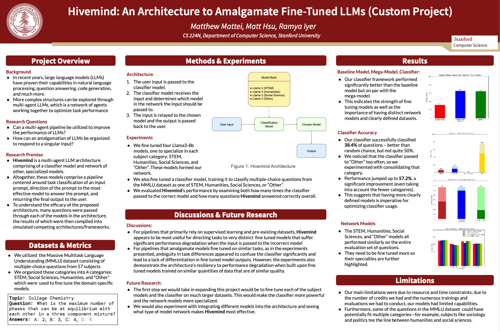

# Hivemind: An Architecture to Amalgamate Fine-Tuned LLMs

Created by: Matthew Mattei, Matt Hsu, and Ramya Iyer

## Overview

Hivemind is a multi-model architecture designed to leverage the strengths of multiple specialized large language models (LLMs) through a central classifier model. The architecture aims to optimize performance by selecting the most suitable model for a given input from a network of finetuned LLMs. This approach outperforms baseline models in terms of accuracy, particularly when addressing subject-specific tasks.

## Key Components

- **Classifier Model**: Trained to determine the most appropriate model in the network for processing a given input.
- **Specialized Models**: Finetuned for different subject categories—STEM, Humanities, Social Sciences, and Other (e.g., accounting, business).
- **Dataset**: Utilizes the Massive Multitask Language Understanding (MMLU) dataset, consisting of multiple-choice questions across various subjects.

## Methodology

1. **Training**: Finetuned Llama3-8b models for different subject categories using the Massive Multitask Language Understanding (MMLU) dataset.
2. **Classifier Training**: A central Llama3-8b model was trained to classify questions into the four subject categories.

## Results

- **Performance**: Hivemind significantly outperformed a non-finetuned baseline model, though it performed on par with the individual models in the network.
- **Insights**:
  1. **Model Distinctiveness**: The effectiveness of the classifier increases when models are sufficiently distinct.
  2. **"Other" Model Usage**: The "other" model is frequently selected by the classifier.
  3. **Dataset Challenges**: Determining ground truths for classifier training can be challenging; techniques like crowdsourcing or using LLMs as judges may help but have limitations.

## Future Work

- **Extended Finetuning**: Longer training periods and larger datasets for both the classifier and specialized models.
- **Granular Categorization**: More detailed subject categories to reduce ambiguity and enhance robustness.

## Conclusion

Hivemind represents a promising step in multi-model architectures, with notable improvements over baseline models and valuable insights for optimization. Future efforts will focus on addressing current limitations and refining the approach for even better performance.

## Acknowledgements

- Massive Multitask Language Understanding (MMLU) dataset
- Pretrained Llama3-8b models

## Made in Stanford CS 224N (NLP with Deep Learning)

## [Linked Research Paper](https://web.stanford.edu/class/cs224n/final-reports/256976188.pdf)
